# IntelliJ Pokémon Progress Bar

[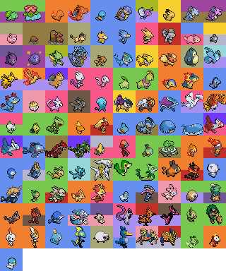](eg/family.gif)

This is [a plugin](https://plugins.jetbrains.com/plugin/15090-pokemon-progress/versions) for [JetBrains IntelliJ IDEA](https://www.jetbrains.com/idea/) (And other compatible IDEs), which replaces your progress bars with a (random) Pokémon. The color of the progress bar fill is based on that Pokémon's type(s). Preferences are located under `Preferences > Appearance & Behaviour > Pokémon Progress`.

If you like the plugin, please consider [rating it on the Marketplace](https://plugins.jetbrains.com/plugin/15090-pokemon-progress/reviews) or [starring it on Github](https://github.com/kagof/intellij-pokemon-progress)!

## Included Pokémon

### Generation I

* 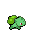 Bulbasaur (#001) 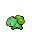
* 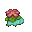 Venusaur (#003) 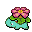
* 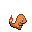 Charmander (#004) 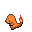
*  Charizard (#006) 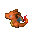
* 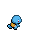 Squirtle (#007) 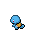
* 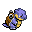 Blastoise (#009) 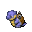
* 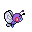 Butterfree (#012) 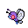
* 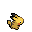 Pikachu (#025) 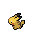
* 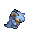 Nidoqueen (#031) 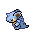
* 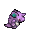 Nidoking (#034) 
* 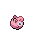 Jigglypuff (#039) 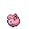
* 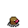 Diglett (#050) 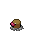
* 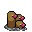 Dugtrio (#051) 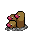
* 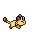 Meowth (#052) 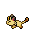
* 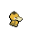 Psyduck (#054) 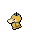
* 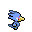 Golduck (#055) 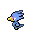
* 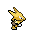 Alakazam (#065) 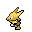
* 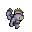 Machamp (#068) 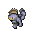
* 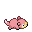 Slowpoke (#079) 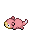
* 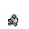 Magnemite (#081) 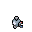
* 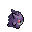 Gengar (#094) 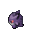
* 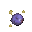 Koffing (#109) 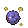
* 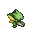 Scyther (#123) 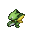
*  Gyarados (#130) 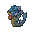
* 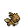 Eevee (#133) 
* 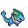 Vaporeon (#134) 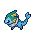
* 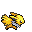 Jolteon (#135) 
*  Flareon (#136) 
*  Snorlax (#143) 
*  Articuno (#144) 
*  Zapdos (#145) 
*  Moltres (#146) 
*  Dragonite (#149) 
*  Mewtwo (#150) 
*  Mew (#151) 

### Generation II

*  Chikorita (#152) 
*  Meganium (#154) 
*  Cyndaquil (#155) 
*  Typhlosion (#157) 
*  Totodile (#158) 
*  Feraligatr (#160) 
*  Togepi (#175) 
*  Espeon (#196) 
*  Umbreon (#197) 
*  Wobbuffet (#202) 
*  Raikou (#243) 
*  Entei (#244) 
*  Suicune (#245) 
*  Lugia (#249) 
*  Ho-Oh (#250) 
*  Celebi (#251) 

### Generation III

*  Treecko (#252) 
*  Sceptile (#254) 
*  Torchic (#255) 
*  Blaziken (#257) 
*  Mudkip (#258) 
*  Swampert (#260) 
*  Wailmer (#320) 
*  Wailord (#321) 
*  Latias (#380) 
*  Latios (#381) 
*  Kyogre (#382) 
*  Groudon (#383) 
*  Rayquaza (#384) 
*  Jirachi (#385) 
*  Deoxys (#386) 

### Generation IV

*  Turtwig (#387) 
*  Torterra (#389) 
*  Chimchar (#390) 
*  Infernape (#392) 
*  Piplup (#393) 
*  Empoleon (#395) 
*  Leafeon (#470) 
*  Glaceon (#471) 
*  Arceus (#493) 

### Generation V

*  Snivy (#495) 
*  Serperior (#497) 
*  Tepig (#498) 
*  Emboar (#500) 
*  Oshawott (#501) 
*  Samurott (#503) 

### Generation VI

*  Chespin (#650) 
*  Chesnaught (#652) 
*  Fennekin (#653) 
*  Delphox (#655) 
*  Froakie (#656) 
*  Greninja (#658) 
*  Sylveon (#700) 

### Generation VII

*  Rowlet (#722) 
*  Decidueye (#724) 
*  Litten (#725) 
*  Incineroar (#727) 
*  Popplio (#728) 
*  Primarina (#730) 
*  Mimikyu (#778) 

### Generation VIII

*  Galarian Articuno (#144) 
*  Galarian Zapdos (#145) 
*  Galarian Moltres (#146) 
*  Grookey (#810) 
*  Rillaboom (#812) 
*  Scorbunny (#813) 
*  Cinderace (#815) 
*  Sobble (#816) 
*  Intelleon (#818) 
*  Wooloo (#831) 
*  Cramorant (#845) 
*  Zacian (#888) 
*  Zamazenta (#889) 

### Generation IX

*  Sprigatito (#906) 
*  Fuecoco (#909) 
*  Quaxly (#912) 

[comment]: <> (end-included-pokemon)

## Contributing

Contributions are very welcome on this project! Contributions can take the form of bug reports, feature requests, pull requests, Pokémon requests or more! Please see our [contributing guidelines](CONTRIBUTING.md) and [code of conduct](CODE_OF_CONDUCT.md) to get started.

## Acknowledgements

### Sprites

* [Pokencyclopedia SpriteDex - Heart Gold & Soul Silver](https://www.pokencyclopedia.info/en/index.php?id=sprites/overworlds/o-r_hgss)
  * All Gen I-IV sprites unless otherwise noted
  * MissingNo.
* [Kyle-Dove on DeviantArt](https://www.deviantart.com/kyle-dove/gallery)
  * Snivy, Tepig, Oshawott
* [cSc-A7X on DeviantArt](https://www.deviantart.com/csc-a7x/gallery)
  * Serperior, Emboar, Samurott
* [princess-phoenix on DeviantArt](https://www.deviantart.com/princess-phoenix/art/Gen-6-Kalos-Pokemon-Overworld-Sprites-525954409)
  * All Gen VI sprites unless otherwise noted
* [JuJoAura on DeviantArt](https://www.deviantart.com/jujoaura/art/Sylveon-Full-Sprite-379989482)
  * Sylveon
* [Princess-Phoenix, Larryturbo, Kiddkatt, Zender1752, SageDeoxys, curated by Larryturbo](https://www.deviantart.com/larryturbo/art/Gen-7-Alola-Overworld-Sprites-805455576)
  * All Gen VII sprites unless otherwise noted
* [SageDeoxys](https://www.pokecommunity.com/showthread.php?t=429414)
  * All Gen VIII sprites unless otherwise noted
* [DarkusShadow on DeviantArt](https://www.deviantart.com/darkusshadow)
  * All Gen IX sprites unless otherwise noted

### Code

* The code for the progress bar itself was adapted from [Nyan Progess Bar](https://github.com/batya239/NyanProgressBar).
* This plugin is of course heavily dependent on JetBrains' IntelliJ SDK
* All the [contributors](https://github.com/kagof/intellij-pokemon-progress/graphs/contributors) who've helped build this plugin

### Colours

* Official scheme colours taken from [Bulbapedia's Type color templates](https://bulbapedia.bulbagarden.net/wiki/Category:Type_color_templates)
* Artemis251 scheme colours taken from [Artemis251's Pokémon Emerald Randomizer Type Color Guide](http://artemis251.fobby.net/downloads/emerald/)
* Nyjee scheme colours taken from [Nyjee's Pokémon Type Colors on DeviantArt](https://www.deviantart.com/nyjee/art/pokemon-type-colors-807671821)

### Misc

* Sprite Gif editing done with [ImageMagick](https://imagemagick.org/script/index.php) (using [this](./editSprite.sh) script)
* Types, names, numbers, & info mainly gathered from [Bulbapedia](https://bulbapedia.bulbagarden.net)
* The idea for this plugin came from [KikiManjaro's Pokemon Trainer Progress Bar](https://plugins.jetbrains.com/plugin/14609-pokemon-trainer-progress-bar)
* Family photo generated using [Scrimage](https://github.com/sksamuel/scrimage) for GIF reading & writing
* The Pokémon Company, for creating Pokémon
