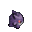
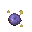
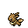
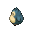
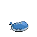
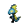

# IntelliJ Pokémon Progress Bar

This is [a plugin](https://plugins.jetbrains.com/plugin/15090-pokemon-progress/versions) for [JetBrains IntelliJ IDEA](https://www.jetbrains.com/idea/), which replaces your progress bars with a (random) Pokémon. The color of the progress bar fill is based on that Pokémon's type(s).

## Included Pokémon

### Generation I

*  Bulbasaur (#1) 
*  Venusaur (#3) 
*  Charmander (#4) 
*  Charizard (#6) 
*  Squirtle (#7) 
*  Blastoise (#9) 
*  Butterfree (#12) 
*  Pikachu (#25) 
*  Nidoqueen (#31) 
*  Nidoking (#34) 
*  Jigglypuff (#39) 
*  Meowth (#52) 
*  Alakazam (#65) 
*  Machamp (#68) 
*  Slowpoke (#79) 
*  Magnemite (#81) 
*  Gengar (#94) 
*  Koffing (#109) 
*  Scyther (#123) 
*  Gyarados (#130) 
*  Eevee (#133) 
*  Snorlax (#143) 
*  Articuno (#144) 
*  Zapdos (#145) 
*  Moltres (#146) 
*  Dragonite (#149) 
*  Mewtwo (#150) 
*  Mew (#151) 

### Generation II

*  Chikorita (#152) 
*  Meganium (#154) 
*  Cyndaquil (#155) 
*  Typhlosion (#157) 
*  Totodile (#158) 
*  Feraligatr (#160) 
*  Togepi (#175) 
*  Wobbuffet (#202) 
*  Raikou (#243) 
*  Entei (#244) 
*  Suicune (#245) 
*  Lugia (#249) 
*  Ho-oh (#250) 
*  Celebi (#251) 

### Generation III

*  Wailmer (#320) 
*  Wailord (#321) 

### Generation VII

*  Mimikyu (#778) 

### Generation VIII

*  Grookey (#810) 
*  Rillaboom (#812) 
*  Scorbunny (#813) 
*  Cinderace (#815) 
*  Sobble (#816) 
*  Intelleon (#818) 
*  Wooloo (#831) 
*  Zacian (#888) 
*  Zamazenta (#889) 

## Contributing

Contributions are very welcome on this project! Please see our [contributing guidelines](CONTRIBUTING.md) and [code of conduct](CODE_OF_CONDUCT.md) to get started.

## Acknowledgements

### Sprites

* [Pokencyclopedia SpriteDex - Heart Gold & Soul Silver](https://www.pokencyclopedia.info/en/index.php?id=sprites/overworlds/o-r_hgss)
    * Bulbasaur, Venusaur, Charmander, Charizard, Squirtle, Blastoise, Butterfree, Pikachu, Nidoqueen, Nidoking, Jigglypuff, Meowth, Alakazam, Machamp, Slowpoke, Magnemite, Gengar, Koffing, Scyther, Gyarados, Eevee, Snorlax, Articuno, Zapdos, Moltres, Dragonite, Mewtwo, Mew
    * Chikorita, Meganium, Cyndaquil, Typhlosion, Totodile, Feraligatr, Togepi, Wobbuffet
    * Wailmer, Wailord
    * MissingNo.
* [Bulbagarden Archives](https://archives.bulbagarden.net)
    * Mimikyu (first frame)
* [SageDeoxys](https://www.pokecommunity.com/showthread.php?t=429414)
    * Grookey, Rillaboom, Scorbunny, Cinderace, Sobble, Intelleon, Wooloo, Zacian, Zamazenta

### Code

* The code for the progress bar itself was adapted from [Nyan Progess Bar](https://github.com/batya239/NyanProgressBar).
* This plugin is of course heavily dependent on JetBrains' IntelliJ SDK  

### Misc

* Gif editing done with [ImageMagick](https://imagemagick.org/script/index.php) (using [this](./editSprite.sh) script)
* Types, names, numbers, & info mainly gathered from [Bulbapedia](https://bulbapedia.bulbagarden.net)
* Type colours taken from [Bulbapedia's Type color templates](https://bulbapedia.bulbagarden.net/wiki/Category:Type_color_templates)
* The idea for this plugin came from [KikiManjaro's Pokemon Trainer Progress Bar](https://plugins.jetbrains.com/plugin/14609-pokemon-trainer-progress-bar)
* The Pokémon Company, for creating Pokémon