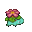
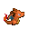
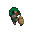
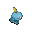
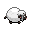
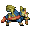
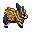

# IntelliJ Pokémon Progress Bar

This is a plugin for [JetBrains IntelliJ IDEA](https://www.jetbrains.com/idea/), which replaces your progress bars with a (random) Pokémon. The color of the progress bar fill is based on that Pokémon's type(s).

## Included Pokémon

### Generation I

*  #1 Bulbasaur
*  #3 Venusaur
*  #4 Charmander
*  #6 Charizard
*  #7 Squirtle
*  #9 Blastoise
*  #25 Pikachu
*  #133 Eevee

### Generation VII

*  #778 Mimikyu

### Generation VIII

*  #810 Grookey
*  #812 Rillaboom
*  #813 Scorbunny
*  #815 Cinderace
*  #816 Sobble
*  #818 Intelleon
*  #831 Wooloo
*  #888 Zacian
*  #889 Zamazenta

## Acknowledgements

### Sprites

* [Pokencyclopedia SpriteDex - Heart Gold & Soul Silver](https://www.pokencyclopedia.info/en/index.php?id=sprites/overworlds/o-r_hgss)
    * Blastoise, Bulbasaur, Charizard, Charmander, Pikachu, Squirtle, Venusaur
* [Bulbagarden Archives](https://archives.bulbagarden.net)
    * Mimikyu (first frame)
* [SageDeoxys](https://www.pokecommunity.com/showthread.php?t=429414)
    * Grookey, Rillaboom, Scorbunny, Cinderace, Sobble, Intelleon, Wooloo, Zacian, Zamazenta

### Code

* Much of the UI code (as well as the idea) was adapted from [Nyan Progess Bar](https://github.com/batya239/NyanProgressBar).
* This plugin is of course heavily dependent on JetBrains' IntelliJ SDK  

### Misc

* Gif editing done with [ImageMagick](https://imagemagick.org/script/index.php) (using [this](./editSprite.sh) script)
* Types, names, numbers, & info mainly gathered from [Bulbapedia](https://bulbapedia.bulbagarden.net)
* Type colours taken from [Bulbapedia's Type color templates](https://bulbapedia.bulbagarden.net/wiki/Category:Type_color_templates)
* The Pokémon Company, for creating Pokémon